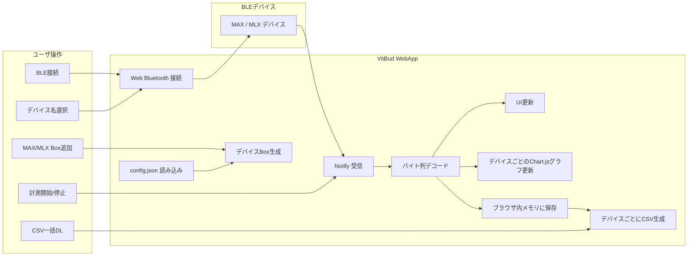

<div id="top"></div>

# VitBuds WebApp

VitBuds WebApp は，Web Bluetooth を用いて MAX30102 系デバイスと MLX90632 系デバイスをブラウザ上で接続し，脈波データおよび赤外線温度データをリアルタイムに可視化・保存する Web アプリケーションである．

MAX デバイスおよび MLX デバイスは，それぞれ 0〜5 台まで任意に追加できる．追加したデバイス Box ごとに BLE 接続，リアルタイム表示，個別グラフ表示，CSV 保存を行う．  
デバイス候補名，UUID，サンプルサイズ，まとめ送信数，サンプリングレート，グラフ表示時間，距離判定閾値などの設定は `config.json` で管理する．

---

## 使用技術一覧

<p style="display: inline">
  
  
  
  
  
  
  
  
  
</p>

---

## 目次

- [プロジェクトについて](#プロジェクトについて)
- [ファイル構成](#ファイル構成)
- [利用ライブラリ](#利用ライブラリ)
- [対応デバイス](#対応デバイス)
- [設定ファイル](#設定ファイル)
- [BLE通信仕様](#ble通信仕様)
- [画面構成](#画面構成)
- [計測開始条件](#計測開始条件)
- [グラフ表示](#グラフ表示)
- [保存データ](#保存データ)
- [データフロー](#データフロー)
- [使用方法](#使用方法)
- [注意点](#注意点)

---

## プロジェクトについて

VitBuds WebApp は，耳装着型デバイスに接続された MAX30102 系センサと MLX90632 系センサを，ブラウザ上で接続・計測するための Web アプリケーションである．

本アプリでは，MAX デバイスと MLX デバイスをそれぞれ動的に追加できる．  
初期状態では各パネルにデバイスBoxは表示されず，ユーザが「＋ MAX デバイス追加」または「＋ MLX デバイス追加」を押すことで，接続用Boxを追加する．

各Boxでは，BLEデバイスの選択，接続，解除，状態表示，リアルタイムデータ表示，個別グラフ表示を行う．  
計測後は，追加されている各デバイスのデータを個別のCSVファイルとして連続ダウンロードする．

<p align="right">(<a href="#top">トップへ戻る</a>)</p>

---

## ファイル構成

```text
.
├── index.html
├── style.css
├── app.js
├── config.json
└── README.md
````

<p align="right">(<a href="#top">トップへ戻る</a>)</p>

---

## 利用ライブラリ

本アプリは以下の外部ライブラリを使用する．

* **Chart.js**

  * リアルタイムグラフ描画に使用する．

`index.html` 内で CDN から読み込む．

```html
<script src="https://cdn.jsdelivr.net/npm/chart.js"></script>
```

CSVファイル生成には外部ライブラリを使用せず，JavaScript の `Blob` と `download` 属性を用いる．

<p align="right">(<a href="#top">トップへ戻る</a>)</p>

---

## 対応デバイス

### MAX 系デバイス

MAX30102 を用いた脈波取得デバイスを想定する．
本アプリでは，MAX から送信される IR/RED の RAW データを受信する．

`config.json` に登録されている候補名は以下である．

```json
[
  "MAX R",
  "MAX R mini",
  "MAX L",
  "MAX L mini",
  "MAX fin",
  "MAX earlobe"
]
```

### MLX 系デバイス

MLX90632 を用いた赤外線温度取得デバイスを想定する．
Ambient 温度，Object 温度，Raw Ambient，Raw Object を受信する．

`config.json` に登録されている候補名は以下である．

```json
[
  "MLX R",
  "MLX R mini",
  "MLX L",
  "MLX L mini"
]
```

<p align="right">(<a href="#top">トップへ戻る</a>)</p>

---

## 設定ファイル

`config.json` では，アプリ名，バージョン，接続条件，BLE 通信仕様，デバイス候補名，表示条件などを管理する．

主な設定項目は以下である．

| 項目 | 内容 |
|---|---|
| `app.name` | アプリ名 |
| `app.version` | バージョン |
| `app.requireAllDevices` | 追加されている Box すべての接続を計測開始条件にするか |
| `app.maxDevicesPerSensor` | MAX/MLX それぞれの最大 Box 数 |
| `sensors.MAX.serviceUUID` | MAX の BLE Service UUID |
| `sensors.MAX.characteristicUUID` | MAX の BLE Characteristic UUID |
| `sensors.MAX.sampleByteSize` | MAX の1サンプルのバイト数 |
| `sensors.MAX.samplesPerNotification` | MAX の1回の Notify にまとめるサンプル数 |
| `sensors.MAX.samplingRateHz` | MAX の想定サンプリングレート [Hz] |
| `sensors.MAX.chartVisibleSeconds` | MAX グラフで表示する時間幅 [s] |
| `sensors.MAX.distanceIrThreshold` | MAX の距離判定閾値 |
| `sensors.MAX.deviceNames` | MAX の候補デバイス名 |
| `sensors.MLX.serviceUUID` | MLX の BLE Service UUID |
| `sensors.MLX.characteristicUUID` | MLX の BLE Characteristic UUID |
| `sensors.MLX.sampleByteSize` | MLX の1サンプルのバイト数 |
| `sensors.MLX.plotCount` | MLX グラフに表示する最大点数 |
| `sensors.MLX.deviceNames` | MLX の候補デバイス名 |

MAX のグラフ表示点数は，`samplingRateHz × chartVisibleSeconds` から算出する．たとえば `samplingRateHz = 100`，`chartVisibleSeconds = 1.0` の場合，MAX グラフには直近 1 秒分，すなわち 100 点を表示する．

<p align="right">(<a href="#top">トップへ戻る</a>)</p>

---

## BLE通信仕様

### MAX

MAX は RAW データ用 Characteristic から通知を受信する．

```json
{
  "serviceUUID": "3a5197ff-07ce-499e-8d37-d3d457af549a",
  "characteristicUUID": "abcdef01-1234-5678-1234-56789abcdef1",
  "sampleByteSize": 12,
  "samplesPerNotification": 5,
  "samplingRateHz": 100
}
```

1 サンプルは 12 byte であり，以下の順に格納される．

| Offset | 型      | 内容               |
| -----: | ------ | ---------------- |
|      0 | uint32 | IR Value         |
|      4 | uint32 | RED Value        |
|      8 | uint32 | SensorElapsed_ms |

リトルエンディアンで読み取る．

MAX では，BLE Notify の回数を減らすため，複数サンプルを1回の Notify にまとめて送信する．現在は `samplesPerNotification = 5` であり，1回の Notify に 5 サンプル，すなわち 60 byte を含める．100 Hz のデータ密度を維持しつつ，Notify 回数を 100 回/s から 20 回/s へ減らす構成である．

### MLX

MLX は温度データ用 Characteristic から通知を受信する．

```json
{
  "serviceUUID": "4a5197ff-07ce-499e-8d37-d3d457af549a",
  "characteristicUUID": "fedcba98-7654-3210-fedc-ba9876543210",
  "sampleByteSize": 16
}
```

1 サンプルは 16 byte であり，以下の順に格納される．

| Offset | 型       | 内容               |
| -----: | ------- | ---------------- |
|      0 | float32 | Ambient_C        |
|      4 | float32 | Object_C         |
|      8 | int16   | Raw_Ambient      |
|     10 | int16   | Raw_Object       |
|     12 | uint32  | SensorElapsed_ms |

リトルエンディアンで読み取る．

<p align="right">(<a href="#top">トップへ戻る</a>)</p>

---

## 画面構成

### 全体

画面上部には，以下のボタンを配置する．

* 計測開始 / 計測停止
* 一括ダウンロード（CSV）

画面下部には，MAXパネルとMLXパネルを配置する．
各パネルには，デバイス追加ボタンとデバイスBox一覧を表示する．

### MAXパネル

MAXパネルでは，「＋ MAX デバイス追加」ボタンを押すことでMAX用Boxを追加する．
各Boxでは以下を表示する．

- デバイス名選択プルダウン
- 接続ボタン
- 解除ボタン
- 接続状態
- 接続デバイス名
- 計測開始からの経過時間
- 距離状態
- IR/RED の個別グラフ

距離状態は IR Value に基づいて判定する．
IR Value が `distanceIrThreshold` 未満の場合は「離れています」，閾値以上の場合は「正常」と表示する．

### MLXパネル

MLXパネルでは，「＋ MLX デバイス追加」ボタンを押すことでMLX用Boxを追加する．
各Boxでは以下を表示する．

- デバイス名選択プルダウン
- 接続ボタン
- 解除ボタン
- 接続状態
- 接続デバイス名
- Ambient 温度
- Object 温度
- 計測開始からの経過時間
- Object 温度の個別グラフ

<p align="right">(<a href="#top">トップへ戻る</a>)</p>

---

## 計測開始条件

`config.json` の `app.requireAllDevices` により，計測開始条件を切り替える．

```json
{
  "requireAllDevices": true
}
```

`true` の場合，追加されているすべてのデバイスBoxが接続済みのときに計測開始できる．
`false` の場合，1台以上のデバイスが接続されていれば計測開始できる．

デバイスBoxが1つも追加されていない場合，計測は開始できない．

<p align="right">(<a href="#top">トップへ戻る</a>)</p>

---

## グラフ表示

### MAXグラフ

MAXでは，デバイスBoxごとに個別のグラフを表示する．
各グラフには以下の2系列を表示する．

- IR
- RED

IR と RED は別の Y 軸で表示する．横軸には，マイコン側の `SensorElapsed_ms` を基準にした相対時間を用いる．

MAX は1回の Notify に複数サンプルをまとめて送るため，WebApp 側では受信したバイト列を 12 byte ごとに切り出し，すべてのサンプルをグラフに追加する．Chart.js の更新は Notify ごとにまとめて実行するため，CSV には100 Hzの全サンプルを保存しつつ，描画負荷を抑える．

MAX グラフの表示点数は，`sensors.MAX.samplingRateHz × sensors.MAX.chartVisibleSeconds` により決定する．

### MLXグラフ

MLXでは，デバイスBoxごとに個別のグラフを表示する．
各グラフには以下の1系列を表示する．

- Object 温度

表示点数は `config.json` の `sensors.MLX.plotCount` に従う．

<p align="right">(<a href="#top">トップへ戻る</a>)</p>

---

## 保存データ

計測データは，追加されている各デバイスBoxごとにブラウザ上のメモリへ蓄積される．
「一括ダウンロード（CSV）」を押すと，存在するデバイスBoxの数に応じて，CSVファイルを連続ダウンロードする．

CSVファイル名は以下の形式である．

```text
deviceName_yyyy-mm-dd-hh-mm.csv
```

デバイス名に空白が含まれる場合，空白は `_` に置き換える．
例：

```text
MAX_R_2026-05-12-14-30.csv
MAX_bub_2026-05-12-14-30.csv
MLX_L_mini_2026-05-12-14-30.csv
```

### MAX の保存列

| 列名               | 内容                       |
| ---------------- | ------------------------ |
| IR_Value         | IR の RAW 値               |
| RED_Value        | RED の RAW 値              |
| SensorElapsed_ms | マイコン側の経過時間 [ms]          |
| RecvEpoch_ms     | ブラウザが受信した時刻 [epoch ms]   |
| RecvJST          | ブラウザが受信したローカル時刻          |
| MeasureElapsed_s | WebApp 側の計測開始からの経過時間 [s] |

### MLX の保存列

| 列名               | 内容                       |
| ---------------- | ------------------------ |
| Ambient_C        | Ambient 温度 [°C]          |
| Object_C         | Object 温度 [°C]           |
| Raw_Ambient      | Raw Ambient 値            |
| Raw_Object       | Raw Object 値             |
| SensorElapsed_ms | マイコン側の経過時間 [ms]          |
| MeasureElapsed_s | WebApp 側の計測開始からの経過時間 [s] |
| RecvEpoch_ms     | ブラウザが受信した時刻 [epoch ms]   |
| RecvJST          | ブラウザが受信したローカル時刻          |

<p align="right">(<a href="#top">トップへ戻る</a>)</p>

---

## データフロー



<p align="right">(<a href="#top">トップへ戻る</a>)</p>

---

## 使用方法

### 1．WebAppを開く

URLを開く．
ローカルで確認する場合は，`config.json` を `fetch()` で読み込むため，`index.html` を直接ダブルクリックせず，ローカルサーバ経由で開く．

例：

```bash
python -m http.server 8000
```

ブラウザで以下にアクセスする．

```text
http://localhost:8000
```

### 2．デバイスBoxを追加する

MAXを接続する場合は，「＋ MAX デバイス追加」を押す．
MLXを接続する場合は，「＋ MLX デバイス追加」を押す．

各センサ種別につき，0〜5台まで追加できる．

### 3．デバイス名を選択する

追加されたBox内のプルダウンから，接続したいBLEデバイス名を選択する．

### 4．接続する

各Boxの「接続」ボタンを押し，BLEデバイスを選択して接続する．
接続に成功すると，状態が「接続済み」になり，接続したデバイス名が表示される．

### 5．計測を開始する

必要なデバイスが接続されると，「計測開始」ボタンが有効化される．
ボタンを押すと，追加されている各デバイスの通知受信を開始する．

### 6．データを確認する

計測中は，各Box内の数値表示と個別グラフがリアルタイムに更新される．

### 7．計測を停止する

計測中に「計測停止」ボタンを押すと，各デバイスの通知受信を停止する．

### 8．CSVを保存する

データが1件以上受信されると，「一括ダウンロード（CSV）」ボタンが有効化される．
ボタンを押すと，追加されている各デバイスごとにCSVファイルを連続ダウンロードする．

<p align="right">(<a href="#top">トップへ戻る</a>)</p>

---

## 注意点

* Web Bluetooth は対応ブラウザでのみ使用できる．
* iOS Safari では Web Bluetooth が利用できない場合がある．
* Web Bluetooth を使用するため，HTTPS環境または `localhost` で開く必要がある．
* `config.json` は `index.html` と同じ階層に配置する．
* `config.json` を変更した場合は，ページを再読み込みする．
* デバイス名は Arduino 側の BLE アドバタイズ名と一致させる．
* MAX と MLX の送信バイト列は，この README の仕様と一致させる．
- `sensors.MAX.samplingRateHz` は WebApp 側の表示・記録用メタ情報であり，Arduino 側の `sampleRate` も同じ値に設定する必要がある．
* 計測中はデバイスBoxの追加・削除を行わない．
* 計測後，接続を解除しても保存済みデータは消えない．
* 新しい計測を開始すると，前回のブラウザ内データとグラフはリセットされる．
* 1クリックで複数CSVを保存するため，ブラウザによっては複数ファイルのダウンロード許可を求められる場合がある．

<p align="right">(<a href="#top">トップへ戻る</a>)</p>